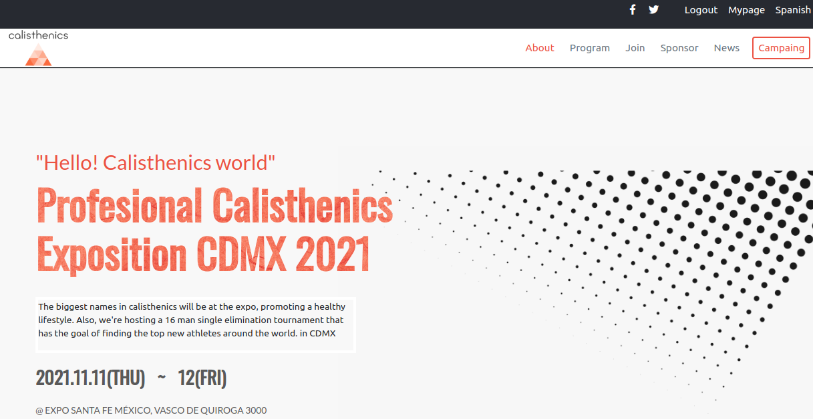
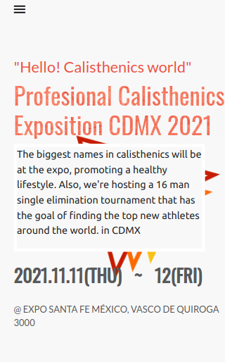

# Calisthenics Expo

>  This project is a page for a no existing calisthenics expo. The design authorship is from Cindy Shin.

## Desktop 💻

## Mobile 📱

## Live Demo 
https://mike2611.github.io/calisthenics-guide/

## Original Design 
https://www.behance.net/gallery/29845175/CC-Global-Summit-2015

## Explanation Video
https://www.loom.com/share/03793c73a1f044509bfff4a4d82543cf
 
## Built With

- HtML, CSS, JS
- VSCode

## Install

To get a local copy up and running follow these simple example steps.
- Open terminal
- Clone this project by command git clone
- Open index.html in the browser (you can use Live Server extension in Visual Studio Code)

## Authors

👤 **Miguel Angel Puentes**
- GitHub: [@mike2611](https://github.com/mike2611)
- Twitter: [@MiguelP2611](https://twitter.com/MiguelP2611)
- LinkedIn: [Miguel Puentes Mata](https://linkedin.com/in/miguel-puentes-mata-90a562139/)

## Contributing

Contributions, issues, and feature requests are welcome!

## Show your support

Give a ⭐️ if you like this project!

